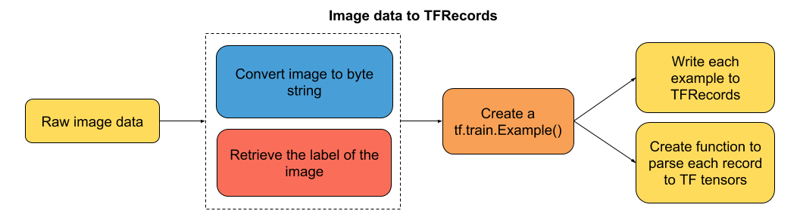
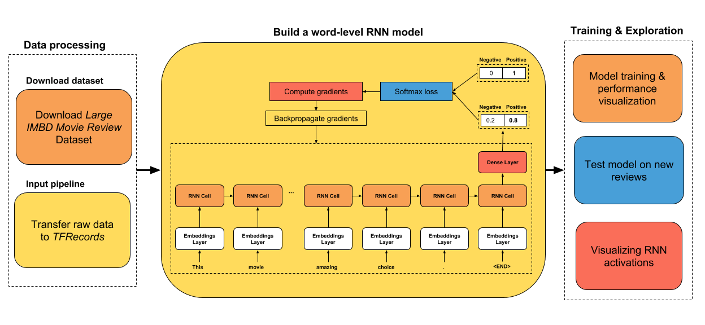

## Simple tutorials on deep learning using TensorFlow Eager

This repo aims to help people who would like to start getting hands-on experience with deep learning using the TensorFlow Eager mode. TensorFlow Eager mode lets you build neural networks as easy as you would do with Numpy, with the huge advantage that it provides automatic differentiation (no more handwritten backprop. YAAAY!). It can ran also on GPUs making the neural networks training significantly faster.

I will try to make the tutorials accessible for everyone, thus I will try to work on problems that do not require a GPU to work on.

**TensorFlow Version used in the tutorials - 1.7**

### List of tutorials available:
#### Getting started
---
* **01. Build a simple neural network** - This tutorial shows you how to build and train a one-hidden layer neural network using the Eager mode of TensorFlow, on a synthetically generated dataset.

* **02. Using metrics in Eager mode** - This tutorial shows you how to use metrics
that are compatible with Eager mode, for three types of machine learning problems (multi-classification, imbalanced dataset and regression).

#### Simple but useful stuff
---
* **03. Save and restore a trained model** - Simple tutorial on how you can save a trained model and restore it at a later time to make predictions on new data.

* **04. Transfer text data to TFRecords** - This tutorial shows you how to store text data of variable sequence length to TFRecords. The data can be easily padded
on the fly, within a batch, when reading the dataset with an iterator.

* **05. Transfer image data to TFRecords** - Easy and simple tutorial on how to transfew image data and its metadata (e.g. target) to TFRecords.

* **06. How to read TFRecords data in batches** - This tutorial shows you how to read either variable length sequence data or image data, in batches, from TFRecords.

#### Convolutional neural networks
----
* **07. Build a CNN for emotion recognition** - This tutorial shows you how to build a CNN from scratch using the TensorFlow Eager API and the FER2013 dataset. At the end of the tutorial you will be able to test the network on yourself using a webcam. Very fun exercise!

#### Recurrent neural networks
----
* **08. Build a dynamic RNN for sequence classification** - Learn how to work with variable sequence input data. This tutorial shows you how to build a dynamic RNN using the TensorFlow Eager API and the Stanford Large Movie Review Dataset.

* **09. Build a RNN for time series regression** - Learn how to build a RNN for timeseries forecasting.

Requests for tutorials:
----
* If you have any requests for a specific tutorial please let me know.

Improvement advice:
----
* Please let me know if you have any suggestions to improve these tutorials. The aim is to help you getting a good grasp of this framework but I am also looking to improve my programming skills so any feedback will be really appreciated :)!
