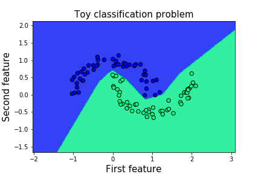
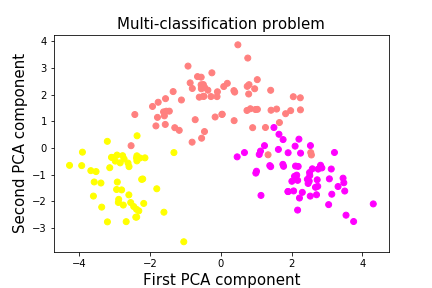
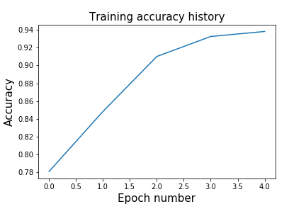
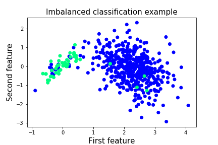
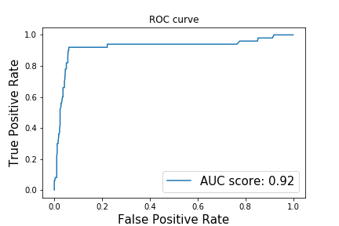
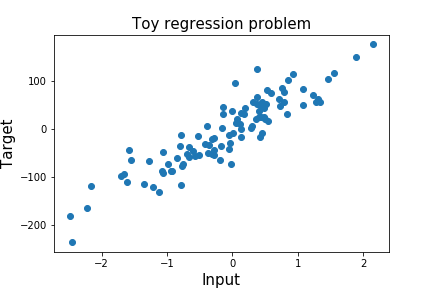
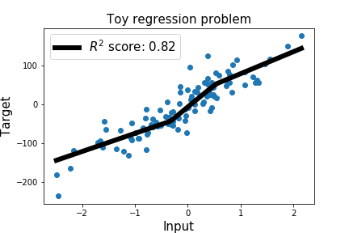

## Simple tutorials on deep learning using TensorFlow Eager

This repo aims to help people who would like to start getting hands-on experience with deep learning using the TensorFlow Eager mode. TensorFlow Eager mode lets you build neural networks as easy as you would do with Numpy, with the huge advantage that it provides automatic differentiation (no more handwritten backprop. YAAAY!). It can ran also on GPUs making the neural networks training significantly faster.
I will try to make the tutorials accessible for everyone, thus I will try to work on problems that do not require a GPU to work on.

**TensorFlow Version used in the tutorials - 1.5**

**Here is the list of tutorials available**:
* **Build a simple neural network with TensorFlow Eager** - This tutorial shows how to build a one-hidden layer neural network using the eager mode of TensorFlow, on a synthetically generated dataset.

* **Using metrics in Eager mode** - This tutorial shows you how to use metrics
that are compatible with Eager mode for three types of machine learning problems. For version 1.5, the tf.metrics module is not compatible when using the Eager mode. Thus, I have created my own functions to compute the majority of the metrics described below, in TensorFlow Eager. Quite a fun exercise :)!
    * **Multi-classification** - Explains how to assess the performance of your neural network using the **accuracy**, **confusion matrix**, **precision score** and the **recall score**, on a multiclassification problem.
    
    * **Imbalanced binary classification** - This part shows you how to compute the
     area under the Receiver Operating Characteristic curve (ROC-AUC score) and also
     how to plot the ROC curve.
     
    * **Regression** - This part of the notebook shows how to compute the coefficient of determination.

* **Building a Convolutional Neural Network (CNN) for emotion recognition with TensorFlow Eager** - This tutorial shows you how to build a CNN from scratch using the TensorFlow Eager API and the FER2013 dataset. At the end of the tutorial you will be able to test the network on yourself using a webcam. Very fun exercise!

  

Requests for tutorials:
----
* If you have any requests for a specific tutorial please let me know.

Improvement advice:
----
* Please let me know if you have any suggestions to improve these tutorials. The aim is to help you getting a good grasp of this framework but I am also looking to improve my programming skills so any feedback will be really appreciated :)!
